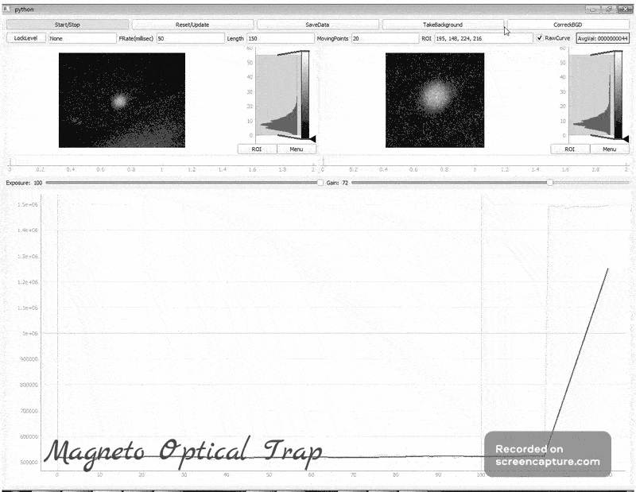

# NeatCamera
This is the python program to manage IDS ueye camera, used in Magneto Optical 
Trap. Idea is simple, take an image, cut the ROI, count the intensity and plot with time.
Although the script is written for IDS ueye's it can work with any camera with opencv.
Just toggle between line 2 & 3 of start.py file

Version 0.00
-- Number of points displayed on intensity curve is Length-MovingPoints
-- Average is displayed for the latest 20 points out of Length.
-- Color shows butten to be pressed for starting/updating the camera/parameters.

